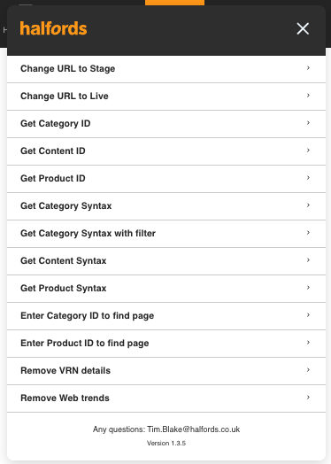

The Quick Link Tool is designed to save you time by bringing a useful collection of shortcuts together in one place. You can switch a page URL between live and staging, quickly find the category ID for the page you are viewing, and access other common tools in a single click.

## How to add the Quick Link tool

1. Create a new bookmark in your browser.
2. Name it something clear like `Quick links tool`.
3. Paste the code below into the bookmark URL field instead of a normal web address. You only need to do this once; updates are automatic.
4. Open a Halfords page and click the bookmark to launch the widget.

## Quick Links code

**Version 1.3.4**

```javascript
javascript:(function(){var h=window.location.hostname;var b=h.includes('halfords.ie')?(h.includes('staging')?'https://staging.halfords.ie':'https://www.halfords.ie'):(h.includes('staging')?'https://staging.halfords.com':'https://www.halfords.com');fetch(b+'/halfords-quick-links-widget.html?_='+Date.now()).then(function(r){return r.text()}).then(function(c){eval(c)})})()
```

Below is a screenshot of the Quick Link Tool preview:


